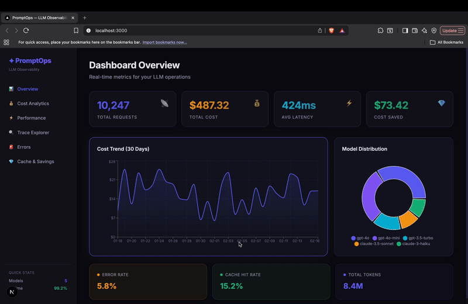

<div align="center">

# ✦ PromptOps

### LLM Observability & Optimization Platform

Track costs, monitor performance, detect hallucinations, and optimize your LLM operations.

[](https://python.org)
[](https://fastapi.tiangolo.com)
[](https://nextjs.org)
[](https://postgresql.org)
[](LICENSE)

</div>

---

## 📺 Demo

<div align="center">



*Real-time LLM observability dashboard with cost tracking, latency monitoring, and ROI analysis*

</div>

---

## 🎯 Problem

Companies using LLMs in production face critical blind spots:

| Problem | Impact |
|---------|--------|
| **No cost visibility** | Budgets blow up without warning |
| **No error tracking** | Hallucinations go undetected |
| **No performance metrics** | Latency spikes hurt user experience |
| **No optimization** | Same queries hit expensive APIs repeatedly |

**PromptOps** solves all of this with a drop-in observability layer.

## 🏗️ Architecture

```
┌──────────────────────────────────────────────┐
│              Your Application                │
│         (uses PromptOps Python SDK)          │
└──────────────────┬───────────────────────────┘
                   │ Auto-instrumented traces
                   ▼
┌──────────────────────────────────────────────┐
│            FastAPI Backend                   │
│  ┌──────────┬───────────┬─────────────────┐  │
│  │ Ingest   │ Analytics │  Eval Engine    │  │
│  │   API    │  Engine   │  (quality)      │  │
│  └────┬─────┴─────┬─────┴────────┬────────┘  │
│       │           │              │            │
│  ┌────▼───────────▼──────────────▼─────────┐  │
│  │  PostgreSQL + pgvector  │  Redis Cache  │  │
│  └─────────────────────────┴───────────────┘  │
└──────────────────────────────────────────────┘
                   │
                   ▼
┌──────────────────────────────────────────────┐
│           Next.js Dashboard                  │
│  📊 Cost  │ ⚡ Latency │ 🔍 Traces │ 💎 ROI │
└──────────────────────────────────────────────┘
```

## ✨ Features

### 📡 Request Logging & Tracing

- Auto-capture every LLM call (OpenAI, Anthropic)
- Full prompt/response storage
- Trace grouping and span tracking

### 💰 Cost Analytics

- Per-model, per-prompt cost tracking
- Daily/weekly spend trends
- Budget alert thresholds

### ⚡ Performance Monitoring

- P50/P95/P99 latency percentiles
- Error rate tracking
- Model-level performance comparison

### 💎 Semantic Cache

- Embedding-based similarity search (pgvector)
- Automatic cache hit detection
- Estimated cost savings

### 📊 Quality Evaluation

- Ground truth comparison
- Basic hallucination detection
- Quality score trends

### 🚀 ROI Calculator

- Real-time savings estimation
- Cache hit impact analysis
- Model routing optimization projections

## 🛠️ Tech Stack

| Layer | Technology | Purpose |
|-------|-----------|---------|
| **API** | FastAPI | High-performance async backend |
| **Database** | PostgreSQL + pgvector | Relational data + vector search |
| **Cache** | Redis | Semantic cache layer |
| **Dashboard** | Next.js 14 | Modern, responsive analytics UI |
| **SDK** | Python (httpx) | Zero-dependency LLM instrumentation |
| **Containers** | Docker Compose | One-command deployment |

## 🚀 Quick Start

### Prerequisites

- Docker & Docker Compose
- Python 3.11+ (for SDK development)
- Node.js 20+ (for dashboard development)

### 1. Clone & Start

```bash
git clone https://github.com/meryemsakin/promptops.git
cd promptops
cp .env.example .env
docker-compose up -d
```

### 2. Seed Demo Data

```bash
docker-compose exec backend python -m backend.seed_data
```

### 3. Open Dashboard

Visit [http://localhost:3000](http://localhost:3000) to see the analytics dashboard.

### 4. Integrate Your App

```bash
pip install ./sdk
```

```python
from openai import OpenAI
from promptops import PromptOps

# Initialize PromptOps
sq = PromptOps(
    api_key="sq-your-api-key",
    endpoint="http://localhost:8000"
)

# Wrap OpenAI — all calls are auto-traced
client = sq.wrap_openai(OpenAI())

response = client.chat.completions.create(
    model="gpt-4o",
    messages=[{"role": "user", "content": "Hello!"}]
)
# ✅ Trace automatically sent to PromptOps!
```

## 📊 Demo Scenario

> **Company:** E-commerce platform with AI-powered customer support
>
> **Monthly LLM Usage:** 10,000 calls · $500/month
>
> **With PromptOps:**
>
> - 📍 30% cache hits → **$150 saved**
> - 🔄 20% model routing → **$20 saved**
> - 📈 15% fewer hallucinations → **quality ↑**
>
> **ROI: $170/month savings + better quality**

## 📁 Project Structure

```
promptops/
├── backend/               # FastAPI backend
│   ├── main.py           # App entry point
│   ├── config.py         # Settings & model pricing
│   ├── database.py       # Async SQLAlchemy engine
│   ├── auth.py           # API key authentication
│   ├── schemas.py        # Pydantic validation models
│   ├── models/           # SQLAlchemy ORM models
│   ├── routers/          # API route handlers
│   ├── services/         # Business logic
│   └── seed_data.py      # Demo data generator
├── sdk/                   # Python SDK
│   └── promptops/
│       ├── __init__.py
│       └── client.py     # OpenAI wrapper & tracing
├── dashboard/             # Next.js 14 dashboard
│   └── src/
│       ├── app/          # Pages & layout
│       └── lib/          # API client & types
├── docker-compose.yml     # Full stack deployment
└── README.md
```

## 🤝 API Reference

| Endpoint | Method | Description |
|----------|--------|-------------|
| `/v1/projects` | POST | Create a project |
| `/v1/projects/{id}/api-keys` | POST | Generate API key |
| `/v1/traces` | POST | Ingest a trace |
| `/v1/traces/batch` | POST | Batch ingest |
| `/v1/traces` | GET | List traces (paginated) |
| `/v1/analytics/overview` | GET | Dashboard overview |
| `/v1/analytics/cost` | GET | Cost breakdown |
| `/v1/analytics/latency` | GET | Latency percentiles |
| `/v1/analytics/usage` | GET | Usage statistics |
| `/v1/analytics/errors` | GET | Error analytics |

All analytics endpoints accept `?days=N` parameter (default: 30).

## 📄 License

MIT License — See [LICENSE](LICENSE) for details.
